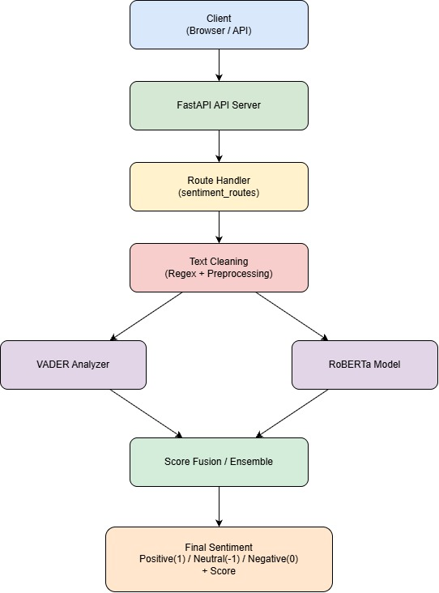

# Technical Documentation for Sentiment Analysis
### Introduction
The Sentiment Analysis System is a Natural Language Processing (NLP) application developed to identify the emotional tone of textual messages. The system analyses short conversational texts and classifies them into positive, negative, or neutral sentiments. It is specifically designed for handling social media content, chat messages, and informal conversational language commonly found in online communication platforms.

The Sentiment Analysis API is responsible for handling API requests, processing user text, performing sentiment prediction, and returning structured responses. The backend is designed using a modular architecture to ensure clean code organization, scalability, and easier maintenance.
The system processes text input and classifies sentiment into categories such as:
- Positive
- Negative
- Neutral

The backend structure separates routing, business logic, and utility functions into different layers for better software design.


### Objectives

- To develop a backend API system capable of analyzing user text and predicting sentiment accurately.
- To classify text into sentiment categories such as positive, negative, and neutral.
- To create a modular and scalable backend architecture for easier maintenance and future development.
- To preprocess and clean textual data before performing sentiment prediction.
- To integrate Natural Language Processing (NLP) techniques for better text understanding.
- To support easy testing, debugging, and deployment of the backend application.
- To provide fast and efficient sentiment prediction for real-time applications.

### Folder Architecture
This backend architecture provides a clean and scalable structure for building a Sentiment Analysis API system. The layered design separates routing, business logic, and utility functions, making the application easy to understand, maintain, and extend for future development. 
```
backend/
│
├── app/
│   │
│   ├── main.py
│   │
│   ├── database/
│   │   ├── db.py
│   │   └── models.py
│   │
│   ├── routes/
│   │   └── sentiment_routes.py
│   │
│   ├── schemas/
│   │   └── sentiment_schema.py
│   │
│   ├── services/
│   │   └── sentiment_service.py
│   │
│   ├── repositories/
│   │   └── sentiment_repository.py
│   │
│   └── utils/
│       └── text_cleaner.py
│
│
└── run.py
```

### Technology Stack

| Technology / Tool          | Purpose                                                           |
| -------------------------- | ----------------------------------------------------------------- |
| Python                     | Programming language used for development                         |
| FastAPI                    | Creation of REST APIs and request handling                        |
| Uvicorn                    | Running and serving the FastAPI application                       |
| VADER Sentiment Analyzer   | Lexicon-based sentiment analysis and scoring                      |
| RoBERTa Sentiment Model    | Transformer-based sentiment analysis for contextual understanding |
| PostgreSQL                 | Storage of chat and sentiment data                                |
| SQLAlchemy                 | ORM for database interaction and query management                 |
| Pydantic                   | Data validation and request/response schemas                      |
| Postman                    | API testing and endpoint validation                               |
| Regular Expressions (`re`) | Text cleaning and preprocessing                                   |
| APIRouter                  | Organizing APIs into separate route modules                       |
| Visual Studio Code         | Code development and debugging                                    |
| Hugging Face Transformers  | Loading and running transformer-based sentiment models            |
| UUID                       | Unique identifier generation for database records                 |
| Git & GitHub               | Version control and source code management                        |


### System Architecture



### Text Preprocessing
Text preprocessing is one of the most important parts of the sentiment analysis pipeline. Raw text data often contains unnecessary symbols, inconsistent formatting, and noisy information that can reduce prediction accuracy.
Employee conversations often contain unnecessary elements such as URLs, mentions, extra spaces, mixed capitalization, and irregular formatting. These elements can affect sentiment prediction accuracy if not handled properly. The preprocessing module prepares the text into a cleaner format before passing it to the sentiment analysis engine. 

The preprocessing workflow includes several operations such as:
- Removing URLs and unwanted links
- Removing user mentions and tags
- Eliminating unnecessary extra spaces
- Python Regular Expressions (re library) 
- Python Spacy for advanced text processing

### Sentiment Classification
The system predicts one of the following sentiment categories:

## Sentiment Categories

| Sentiment | Description                                                                                                        |
| --------- | ------------------------------------------------------------------------------------------------------------------ |
| Positive  | Indicates satisfaction, happiness, appreciation, encouragement, or a favorable opinion.                            |
| Negative  | Indicates frustration, anger, dissatisfaction, disappointment, or an unfavorable opinion.                          |
| Neutral   | Indicates balanced, informational, objective, or emotionless text without a strong positive or negative sentiment. |

The API is also capable of handling mixed conversational contexts where both positive and negative statements appear together. The classification is given using numerical clauses. 
The sentiment classification in this project is performed using the VADER (Valence Aware Dictionary and Sentiment Reasoner) sentiment analyzer. The model calculates sentiment scores for the cleaned input text and uses the compound score to determine the final sentiment category.
The compound score is a normalized value ranging between:

Where:
  -  -1 represents extremely negative sentiment
  -  +1 represents extremely positive sentiment
  -  0 represents neutral sentiment 

### Database Implementation
The project uses PostgreSQL as the primary database to store employee sentiment records generated from chat analysis.
 The database layer is designed to be lightweight, scalable, and efficient for handling real-time API requests.

Each employee message analyzed by the API is stored with its sentiment result, confidence score, and timestamp information. This allows the system to maintain historical sentiment data for future analytics and monitoring.

The database integration is handled using SQLAlchemy, which simplifies communication between the FastAPI backend and PostgreSQL. Instead of writing raw SQL queries repeatedly, the ORM model maps Python classes directly to database tables, making the application cleaner and easier to maintain.

The system uses a UUID-based primary key for every sentiment record. UUIDs provide better uniqueness and scalability compared to normal integer IDs, especially in distributed or enterprise-level systems.
Each record contains:

### Employee Sentiments Table Fields

| Field        | Description                                                                           |
| ------------ | ------------------------------------------------------------------------------------- |
| sentiment_id | Unique sentiment record identifier generated using UUID in PostgreSQL.                |
| company_id   | Unique company identifier using UUID in PostgreSQL.                                   |
| employee_id  | Employee identifier stored as VARCHAR.                                                |
| chat_code    | Unique chat reference code used to identify and fetch chat conversations.             |
| score        | Final sentiment score generated by the hybrid sentiment analysis model.               |
| sentiment    | Final sentiment classification value: `1` = Positive, `0` = Neutral, `-1` = Negative. |
| created_at   | Automatic timestamp indicating when the sentiment record was created.                 |


### Sentiment Analysis Using VADER
The project uses VADER Sentiment for performing real-time sentiment analysis on employee chat messages. VADER (Valence Aware Dictionary and Sentiment Reasoner) is a lightweight rule-based Natural Language Processing model designed to detect emotional tone from text data.
The model analyzes employee conversations and classifies them into positive, neutral, or negative sentiment categories based on the emotional polarity of the message.
VADER was selected for this project because of its fast processing speed, low resource consumption, and effective performance on social media-style or conversational text. It can understand emotional indicators such as punctuation, capitalization, emojis, and commonly used chat expressions.

VADER generates four different sentiment metrics:
- Positive score
- Negative score
- Neutral score
- Compound score

The compound score represents the final overall sentiment value of the text. This score ranges between -1 and 1.

Based on the compound score, the application classifies the sentiment into:
- Positive (1)
- Neutral (0)
- Negative (-1)

The project uses threshold-based classification logic to determine the final sentiment category. Positive scores above a certain threshold are marked as positive, negative scores below a threshold are marked as negative, and values in between are treated as neutral. 

### Sentiment Analysis Using RoBERTa

The project uses RoBERTa for sentiment analysis of employee chat conversations. RoBERTa (Robustly Optimized BERT Pretraining Approach) is a transformer-based Natural Language Processing (NLP) model designed to understand the context and meaning of text more effectively than traditional rule-based approaches.

Unlike dictionary-based sentiment analyzers, RoBERTa learns language patterns from large amounts of text data and can interpret the sentiment behind complete sentences rather than relying solely on individual words. This enables the model to handle conversational language, spelling variations, slang, abbreviations, and complex sentence structures more accurately.
The sentiment analysis process begins when employee chat data is received through the API. After text preprocessing, the cleaned message is passed to the RoBERTa model, which analyzes the context of the entire conversation and predicts the overall sentiment.

The model classifies messages into three sentiment categories:
- Positive
- Neutral
- Negative

For each prediction, RoBERTa generates probability scores indicating the confidence level for each sentiment class. The sentiment with the highest probability is selected as the final prediction. 

### Final Sentiment Score Calculation
To achieve more reliable sentiment analysis, the system combines the scores from both VADER and RoBERTa.

- VADER helps identify sentiment based on words and phrases.
- RoBERTa helps understand the overall context and meaning of the sentence.

Both models contribute equally to the final result.
Formula:
```
Final Score =
(0.5 × VADER Score)
+
(0.5 × RoBERTa Score)

Example:
VADER Score   = 0.60

RoBERTa Score = 0.90

Calculation:
Final Score

= (0.5 × 0.60)
+ (0.5 × 0.90)
= 0.30 + 0.45

= 0.75
```
The final score is then used to determine whether the sentiment is Positive, Neutral, or Negative.


### API Endpoint – Predict Sentiment
This endpoint is used to analyze the sentiment of an employee's chat conversation. The system retrieves the chat message using the provided chat_code, performs sentiment analysis using both VADER and RoBERTa models, and stores the final sentiment result in the employee_sentiments table.

Method
POST

Route
/predict

Request Body
```
{
   "sender_id": "EMP001",
   "chat_code": "CHAT001"
}
```
 
**Description:**
 When a request is sent to this endpoint, the system first locates the chat conversation associated with the provided chat_code. The retrieved chat content is then cleaned and preprocessed to remove unnecessary text such as URLs, special characters, and extra spaces.
The processed text is analyzed using a hybrid sentiment analysis approach that combines VADER and RoBERTa. VADER evaluates sentiment based on words and phrases, while RoBERTa analyzes the overall context and meaning of the conversation. Both model outputs are combined to generate a final sentiment score.

Based on the calculated score, the conversation is classified as:
- Positive (1) – Indicates satisfaction, appreciation, or a positive attitude.
- Neutral (0) – Indicates informational or emotionally balanced communication.
- Negative (-1) – Indicates dissatisfaction, frustration, or a negative attitude.

The final sentiment result is then saved to the employee_sentiments table along with the employee details, chat reference, sentiment score, and timestamp.

Successful Response
```
{
   "sentiment_id": "7a7f5f9f-c31c-4eb9-a60e-57c13f95e68d",
   "company_id": "dcb3b939-d52d-40f1-95b4-f1a10dc1e8f5",
   "employee_id": "101",
   "chat_code": "CHAT001",
   "score": 0.75,
   "sentiment": 1,
   "created_at": "2026-05-27T10:30:20.123456"
}
```
This response confirms that the sentiment analysis was completed successfully and that the result has been stored in the database.
